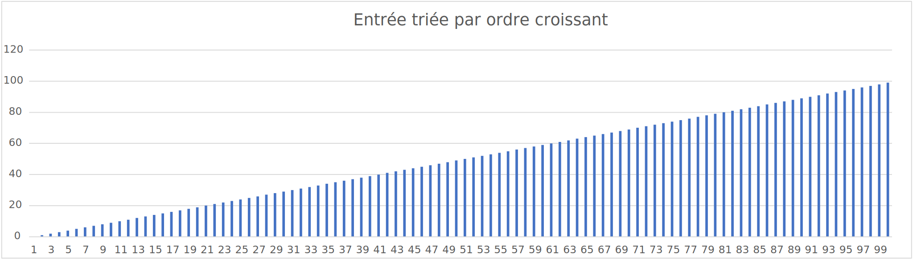
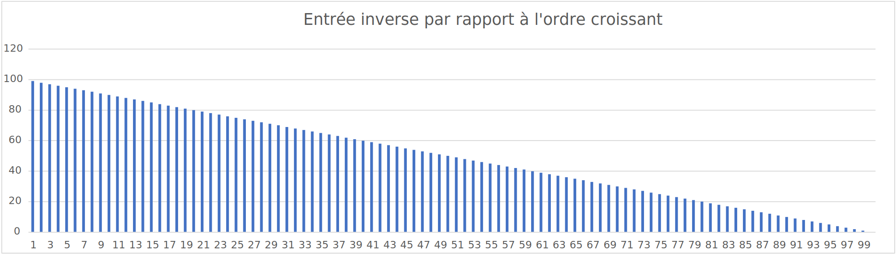
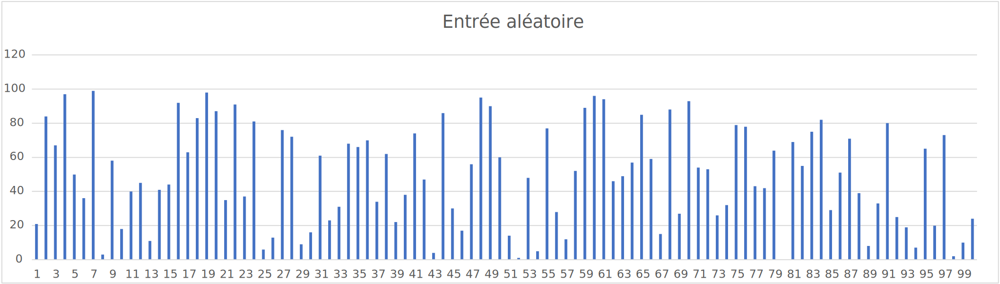
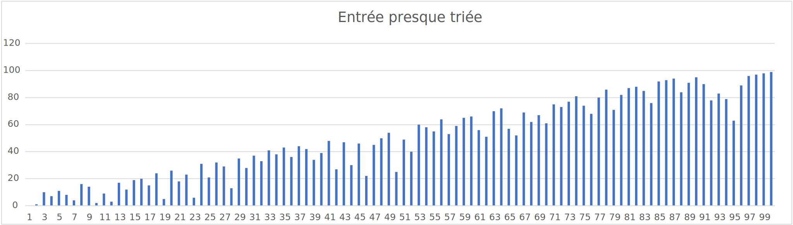

# L1 - Complexité

## Introduction

Le traitement de l'information est un sujet de grande importance dans notre société qui échange un flux continu
d'informations. Ce traitement peut être grandement facilité lorsque ces informations sont triées. La problématique de
l'implémentation et l'analyse des tris est ainsi un sujet d'actualité dans notre société. 

Nous allons nous pencher sur l'analyse de trois tris en particulier : le tri à 
bulle, le tri par insertion et le tri par
sélection. Ces tris peuvent se faire plus ou moins rapidement selon leur implémentation. Il est donc intéressant, voire 
primordial, d'étudier leur complexité pour observer et comprendre les différences entre les tris étudiés, ainsi que la 
manière dont cette complexité se traduit dans différentes situations données.

## Objectifs

Le but premier de ce laboratoire est de nous faire revoir les différents tris appris en PRG1, ainsi que `std::sort` 
et ``std::stable_sort``, et de les implémenter.

Le second but est de créer des données qui nous permettent d'évaluer la complexité de ces différents algorithmes. Cela
se fera via différents paramètres : le temps d'exécution, le nombre 
d'opérations/affectations de chaque algorithme ou 
l'état initial de notre dataset.

Enfin, nous analyserons ces différentes mesures et données dans ce rapport à l'aide de graphiques et de nos 
observations pour déterminer une hiérarchie basée sur l'efficacité de ces algorithmes dépendamment des paramètres
communs.

## Procédure

Pour connaître cette hiérarchie, nous avons créé différentes classes et fonction génériques. Ces dernières nous
permettent d'analyser les paramètres d'importance pour les différents tris donnés. Soit le tri à bulle, le tri 
par insertion, le tri par sélection ainsi que ``std::sort`` et ``std::stable_sort``.

Pour ce faire, une fonction prenant comme paramètre ``vector<T>`` contenant les données à trier, ainsi qu'une fonction 
représentant un certain algorithme de tri, va calculer le temps que prend cette fonction pour s'effectuer. 
Cela se fera pour différentes tailles de vecteurs ainsi qu'un pré-tri des données différent. 

On dispose aussi d'une classe générique possédant plusieurs variables statiques qui sont incrémentées à chaque opération
ou affectation effectuées. Cela nous donnera une vision exacte du nombre d'affectations utilisée et du nombre 
d'opérations effectuées pour chacun des tris. 

Comme dit précédemment, ces mesures se feront avec des vecteurs dans différents 
états :

- Un état dans lequel les éléments du vecteur sont triés dans un ordre croissant 


- Un état dans lequel les éléments du vecteur sont triés dans un ordre décroissant 


- Un état dans lequel les éléments du vecteur sont dans un ordre aléatoire


- Un état dans lequel les éléments du vecteur sont presque triés (pondération d'un vecteur trié et d'un vecteur aléatoire)




[//]: # (Est-ce qu'on veut créer notre propre graphique ? -> regarder pour le faire avec python et pas Excel omg)


Avec les différentes mesures récoltées, nous créons des fichiers csv, à partir desquels nous construirons des graphiques
pour pouvoir comparer les tris. Les tailles N des vecteurs analysés sont les suivantes :  N = {10, 75, 100, 
1000, 5000, 7500, 10000, 20000, 50000, 75000, 100000}.

## Rappels théoriques
Nous avons vu en cours différents types de tris ainsi que leur complexité.
- Tri à bulle
  - Meilleur cas : $\mathcal{O}(n)$
  - Cas moyen : $\mathcal{O}(n^2)$
  - Pire cas : $\mathcal{O}(n^2)$
  - Stabilité : oui
- Tri par insertion
  - Meilleur cas : $\mathcal{O}(n)$
  - Cas moyen : $\mathcal{O}(n^2)$
  - Pire cas : $\mathcal{O}(n^2)$
  - Stabilité : oui
- Tri par sélection
  - Meilleur cas : $\mathcal{O}(n^2)$
  - Cas moyen : $\mathcal{O}(n^2)$
  - Pire cas : $\mathcal{O}(n^2)$
  - Stabilité : non <br>

Selon la [doc](https://en.cppreference.com/w/cpp/algorithm/sort) la complexité des tris provenant de la STL :
- ``std::sort``
  - Cas moyen : $\mathcal{O}(n\log{}n)$
  - Stabilité : non
- ``std::stable_sort``
  - Cas moyen : $\mathcal{O}(n\log{}^2n)$
  - Stabilité : oui
  
On peut avancer que pour nos différents dataset, un dataset croissant 
    correspondra au meilleur cas, un dataset décroissant au pire cas et un 
    dataset aléatoire ou presque trié se rapprochera d'un cas moyen. Néanmoins, 
    pour un vrai cas moyen, il aurait fallu tester plusieurs datasets aléatoires 
    idéalement.

Bien que nos trois algorithmes soient tous de complexité $\mathcal{O}(n^2)$ en moyenne, des
mesures comparatives montrent que le tri par insertion est plus rapide que le tri par
sélection qui, lui-même, est plus rapide que le tri à bulles.


## Analyse

Nous discutons des résultats obtenus en ayant testé les tris avec le type entier 
int. Les mesures de temps seront exposées
puis discutées. Ensuite, les opérations et les affectations auront droit au même traitement. Nous discuterons 
enfin des résultats combinés et des informations que ces derniers nous apportent quant à l'efficacité des tris 
testés.

Les données ont été séparées par type d'ordre de vecteur et nous les analyserons dans l'ordre présenté ci-dessus.

### Mesure de temps

Les premières données analysées seront celle du temps que prend chaque algorithme
à être effectué. Nous commencerons par les données lorsque les vecteurs sont triés
par ordre croissant. 

##### Croissant


Nous observons ici une croissance pour deux tris, le tri par sélection et le tri à bulle. Les valeurs 
des autres tris sont presque invisibles. Observons le graphique avec les mêmes valeurs avec des échelles 
logarithmiques sur les axes X et Y pour obtenir un autre point de vue sur les données. 


Nous observons une forte croissance pour les deux tris mentionnés précédemment, ce sont ceux qui sont le plus lents. 
En plus de cela, nous avons des croissances très similaires entre le tri par sélection, le ``std::sort`` et 
le ``std::stable_sort``, qui mettent donc presque le même temps à s'exécuter pour un même N. 
Il est intéressant de noter que le ``std::stable_sort`` possède une croissance significativement 
plus forte que le ``std::sort``.

##### Décroissant

Observons maintenant lorsque l'ordre des valeurs du dataset est décroissant, avec échelles logarithmiques. 
Comme constaté ci-dessus, cette échelle permet de voir plus de détails au niveau de la croissance des différents tris. 


Ici le tri par sélection s'approche des deux autres tris implémentés. ``std::sort`` et le ``std::stable_sort`` ont
une croissance plus rapide lorsque le dataset n'est pas pré-trié, ce qui veut dire qu'ils sont plus lents. 

##### Aléatoire

Observons lorsque l'ordre des valeurs dans notre vecteur est aléatoire. La fonction générant l'aléatoire est 
```std::minstd_rand0``` et la seed est celle choisie par l'utilisateur (ici, 42).

[//]: # (Vérifier si je dis pas de la caque ^^)
[//]: # (C'est 42, pas 1, je crois)


Le comportement des tris implémentés est très similaire à celui du graphe précédent lorsque les données sont
en ordre décroissant. La différence majeure se situe au niveau de ``std::sort`` et ``std::stable_sort``.
En effet, les deux ont une croissance très semblable. Cela nous permet d'inférer que l'ordre dans lequel le dataset
se situe a un impact sur ces fonctions de la STL.

##### Presque trié

Intéressons-nous maintenant à l'entre-deux. Il y a probablement une limite ou un moment où ``std::sort`` et 
``std::stable_sort`` commence à converger l'un vers l'autre, c'est-à-dire ont un temps d'exécution similaire. 
Vérifions cette hypothèse via notre graphique. 


Il est intéressant de noter qu'à nouveau les deux tris de la STL tendent à avoir la même croissance et donc le même
temps d'exécution pour un même N. 
Des recherches plus poussées nous permettraient de savoir si c'est uniquement dans les cas décroissants et croissants
ceux deux fonctions ont une telle différence. 

##### Conclusion

Nous avons pu observer le comportement de nos tris et des tris de la STL avec différents paramètres de départ. 
Nous avons observé que parmi nos tris, le tri par insertion est celui qui performe le mieux quelque soit l'état
dans lequel se trouve le dataset. Le tri à bulle et le tri par sélection sont ceux qui performent le plus lentement, 
mais ont constamment une croissance très similaire. 

Enfin, l'état dans lequel se trouve le dataset influence le temps que prend ```std::stable_sort```. Observations 
à analyser plus en profondeur dans un autre document si nous y sommes intéressés. 


### Mesures du nombre d'affectations

##### Croissant
Ici, on peut commencer par remarquer que le tri à bulle (caché sur le graphe) et le 
tri par insertion n'ont pas d'affectations peu importe la valeur de n. Cela est 
dû au fait que ces deux tris ne font pas d'échange de valeurs, si ce n'est pas 
nécessaire. Il sera donc intéressant plus tard de s'intéresser aux mesures d'opérations dans ce même cas. 
On voit que c'est ``std::stable_sort`` qui a la plus forte croissance et qui fait donc le plus d'affectations pour un 
certain N.


##### Décroissant
Pour le dataset décroissant, on remarque que ``std::sort`` et le tri par 
sélection sont ceux qui ont la moins grande progression d'affectations en fonction de N et 
ont une progression similaire. 

On voit que ``std:stable_sort`` diverge de 
plus en plus des deux premiers tris mentionnés et le tri à bulle diverge
nettement des trois autres tris. On remarquera qu'à l'instar du tri pour un 
dataset croissant, le tri à bulle est caché par le tri par insertion, car ils 
effectuent exactement le même nombre d'affectations selon nos mesures.


##### Aléatoire
Pour un dataset aléatoire, c'est le tri par sélection qui a la plus faible 
progression d'affectations. Un peu au-dessus on trouve ``std::sort`` puis ``std::stable_sort``
très proche, mais que l'on voit déjà légèrement diverger. Enfin, on voit que le 
tri par insertion montre une progression nettement plus forte que les autres tris.


##### Presque trié
Comme pour le dataset aléatoire, c'est le tri par sélection qui a la plus faible 
taux de croissance. On peut noter que pour des n petits (< 100), il effectue tout 
de même plus d'opérations (dépend aussi de notre dataset). À l'instar du dataset 
aléatoire, on retrouve un peu au-dessus ``std::sort`` suivi par ``std::stable_sort``.
Encore une fois, le tri par insertion et le tri à bulle montrent une progression 
nettement plus forte.


#### Conclusion
On voit que pour des datasets aléatoires et presque triés, le tri par sélection est 
celui qui a la moins grosse progression d'affectations et donc qui est le plus efficace, en terme de
nombre d'affectations effectuées. 

## Mesures du nombre d'opérations

#### Croissant

Encore une fois, on décide d'utiliser une échelle logarithmique sur les axes x et y de tous les graphiques suivants, 
afin de les rendre plus parlants et intéressants à analyser.

Premièrement, le tri à bulle et le tri par sélection font exactement le même nombre d'opérations pour le même N, 
c'est pour cela que seul le tri par sélection apparaît sur le graphique, vu qu'il couvre la courbe du tri à bulle.
On remarque d'ailleurs que ce sont ces deux tris qui font le plus d'opérations pour un certain N et que l'augmentation
du nombre d'opérations d'un N à l'autre est plus grande que pour les autres tris.

Les trois autres tris font un nombre d'opérations plutôt similaires. Ils font tous les trois moins d'opérations que 
les deux tris cités ci-dessus. Cela semble cohérent avec le fait que, d'après des études, le tri par insertion est plus
rapide que le tri à bulle et le tri par sélection. On remarque que les deux tris implémentés dans la stl: ``std::sort``
et ``std::stable_sort`` sont ceux qui font le mois d'opérations en général.


#### Décroissant

À nouveau, le tri à bulle et le tri par sélection font exactement le même nombre d'opérations pour un même N. On ne voit 
donc que la courbe du tri par sélection sur le graphe. On remarque que ces deux tris sont ceux qui font le plus 
d'opérations. On remarque aussi que le nombre d'opérations de ces deux tris pour un dataset décroissant est pratiquement
le même que pour un dataset croissant.

Les trois autres tris font moins d'opérations en général. Les deux tris ``std::sort`` et ``std::stable_sort`` restent 
ceux qui font le moins d'opérations, mais on voit que leurs courbes se rapprochent de celle du tri par insertion comparé
au graphique du dataset croissant, ce qui est logique puisqu'un dataset décroissant est une moins bonne situation de 
base pour ce deux tris qu'un dataset croissant.

Parmi les trois tris que nous avons implémentés, le tri à insertion reste celui qui fait le 
moins d'opérations, ce qui est cohérent avec la théorie.


#### Aléatoire

À nouveau, le tri à bulle et le tri par sélection font exactement le même nombre d'opérations pour un même N. On ne voit
donc que la courbe du tri par sélection sur le graphe. Encore une fois, ces deux tris sont ceux qui font le plus 
d'opérations.

On voit que, cette fois, les courbes des tris ``std::sort``, ``std::stable_sort`` et le tri par insertion sont
pratiquement confondues, ils font presque le même nombre d'opérations pour un certain N. On voit donc que les fait que 
le dataset set soit aléatoire impacte la performance des tris ``std::sort`` et ``std::stable_sort``, qui font maintenant
presque le même nombre d'opérations que le tri par insertion que nous avons implémenté à la main.

Parmi les trois tris que nous avons implémentés, le tri à insertion reste celui qui fait le
moins d'opérations, ce qui est cohérent avec la théorie.


#### Presque trié

À nouveau, le tri à bulle et le tri par sélection font exactement le même nombre d'opérations pour un même N. On ne voit
donc que la courbe du tri par sélection sur le graphe.

Les cas du dataset presque trié est pratiquement le même que celui du dataset aléatoire. Les tris par bulle et par
sélection font plus d'opérations pour un certain N que les trois autres, qui ont une bourbe très similaire. On 
en déduit que travailler avec un dataset presque trié au lieu d'un dataset aléatoire ne réduit pas vraiment le nombre
d'opérations à faire pour le trier.


#### Conclusion

On constate qu'en ce qui concerne le nombre d'opérations à faire pour trier un dataset, peu importe son type, le tri à 
bulle et le tri par sélection ont exactement la même performance et sont les moins efficaces. Leur nombre d'opérations 
n'est pas du tout affectée par le type de dataset qu'ils doivent trier. Cette observation est évidemment propre à la
manière dont nous avons implémenté le tri à bulle et le tri par sélection.

Parmi les trois tris que nous avons implémentés à la main, le tri par insertion demande significativement moins 
d'opérations pour trier un dataset que les deux autres. Le type de dataset n'a pas non plus beaucoup d'influence sur le nombre 
d'opérations effectuées. Cette observation est conforme à la théorie qui nous dit que le tri par insertion est plus rapide que le tri à 
bulle et le tri par sélection.

Les deux tris de la STL : ``std::sort`` et ``std::stable_sort`` font, en général, 
moins d'opérations que nos tris 
implémentés à la main pour trier un dataset. ``std::sort`` demande un peu moins d'opérations que ``std::stable_sort``.
Contrairement aux trois autres tris, le nombre d'opérations de ces deux tris est influencé par le type du dataset. Pour
des datasets croissants et décroissants, ``std::sort`` et ``std::stable_sort`` font assez nettement moins d'opérations 
que les trois autres tris. Pour des datasets aléatoires et presque triés, ``std::sort`` et ``std::stable_sort`` font à 
peu près le même nombre d'opérations que notre tri par insertion.

## Conclusion

Nous avons pu, au cours de ce rapport, analyser et décrire le comportement de trois tris implémentés à la main par nos
soins ainsi que deux tris de la STL. Nous avons pu les comparer suivant différents paramètres d'importance, tels que le
temps d'exécution, le nombre d'opérations et le nombre d'affectations. Nous avons aussi pu constater que l'état initial 
dans lequel se trouve le dataset à trier influence les performances des tris, dans certains cas. 

Nous sommes arrivés aux conclusions suivantes:

Dans le pire cas, soit lorsque le dataset est trié dans l'ordre décroissant,
nous observons les tris de la STL font nettement moins d'opérations, d'affectations et prennent moins de temps que 
les tris implémentés. Ils sont donc toujours plus efficaces que nos tris implémentés. ``std::stable_sort`` possède 
une courbe légèrement plus raide que ``std::sort``. 
De plus, on voit que les performances de ``std::sort`` et ``std::stable_sort`` dépendent de manière significatives de
l'état initial du dataset à trier. Ces deux tris sont nettement plus performants en partant d'un dataset croissant 
(meilleur cas) qu'en partant d'un dataset décroissant (pire cas). Lorsque le dataset est aléatoire ou presque trié (cas moyens),
alors ces deux tris ont en général une performance similaire à notre tri par insertion.

Au niveau des tris implémentés par nos soins, la performance ne dépend pratiquement pas de l'état initial du dataset mais
 les comportements sont tout autant intéressants. En effet, parmi nos tris, le tri par insertion est toujours celui qui 
possède la courbe la moins raide pour chaque paramètre et est donc le plus efficace. 
Qui plus est, ce dernier est celui qui, dans le cas moyen, se rapproche le plus des tris de la STL. 
Le tri à bulle et le tri par sélection, eux, possèdent une croissance très similaire avec une pente toujours plus raide que 
les autres algorithmes et sont donc les moins performants. 

De ces différentes informations, nous pouvons inférer que, parmi nos tris, le tri par insertion est celui qui est le
plus efficace. Cette observation est intéressante à faire puisque les trois tris sont de même complexité d'ordre $n^2$.
Cela prouve que la complexité ne permet pas de déterminer exactement l'efficacité d'un tri, mais est bien un ordre de 
grandeur. 
De plus, cette information est cohérente avec le fait que, selon des études évoquées lors du cours de PRG1,
le tri par insertion est plus rapide que le tri par sélection ou le tri à bulle, bien qu'ils aient la même complexité.

Enfin, il est relativement logique que `std::stable_sort` soit en général quelque peu plus complexe que `std::sort` au vu 
de la garantie de stabilité qui implique de préserver l'ordre des éléments lors du tri, ce qui représente donc une
contrainte supplémentaire.

#### Remarque
Il est important de rappeler que ces conclusions dépendent de la manière dont nous avons implémenté nos tris. Ce ne sont
pas forcément des vérités générales, mais dépendantes du contexte dans lequel nous avons pris nos mesures. 
C'est en particulier vrai pour la conséquence que peut avoir l'état initial du dataset à trier sur les performances.