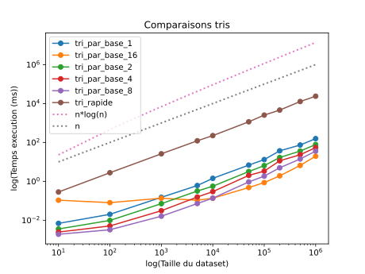

# L3 - Tris

## Introduction

Le laboratoire 3 est consacré à l'étude des tris composés. En informatique, un tri
est un moyen d'organiser une
collection d'objets selon une relation d'ordre prédéfinie. Un tri est dit "composé"
lorsqu'il utilise plusieurs critères
de tri pour trier un tableau d'éléments.

Dans ce laboratoire, nous allons étudier le tri rapide ainsi que le tri par base pour
pouvoir observer leur
complexité, leur fonctionnement et les comparer.

## Objectifs

L'objectif principal de ce laboratoire est d'étudier la complexité des algorithmes
de tri efficaces que sont le tri par base et le tri rapide, afin de les comparer.

Pour cela, nous allons les
implémenter puis créer un programme de test qui vérifie la validité de nos tris et un
second programme effectuant des
tests de temps d'exécution que nous allons mettre en forme dans un graphique, pour
pouvoir comparer les différents
tris et étudier leur complexité.

## Rappels théoriques sur les algorithmes de tri

### Tri rapide

Le tri rapide utilise le principe de "divide and conquer" avec une mise en œuvre
récursive pour trier efficacement un
tableau. Le tri rapide utilise une fonction de partition auxiliaire avec pivot. Afin
d'effectuer un tri
rapide, on choisit d'abord un pivot qui nous permet, grâce à la fonction de
partition, de séparer le tableau en deux,
avec d’un côté les éléments plus petits que le pivot, de l’autre ceux plus grands. On
fait ensuite une récursion dans
chacune des deux partitions.

Dans ce laboratoire, nous avons mis en place une version semi-récursive de tri rapide
qui remplace l'appel sur la
partition la plus grande par une itération afin d'éviter une récursion trop profonde.

| Pire Cas |   Cas Moyen   | Meilleur Cas  | Stabilité | En place |
|:--------:|:-------------:|:-------------:|:---------:|:--------:|
| $O(n^2)$ | $O(n*log(n))$ | $O(n*log(n))$ |    non    |   oui    |

- n: nombre d'éléments dans le tableau

### Tri comptage

Afin d'implémenter le tri par base, nous avons d'abord besoin d'implémenter le tri
comptage.

Le tri comptage compte le nombre d'occurrences de chaque élément distinct d'un
tableau et utilise cette information
pour trier le tableau.

L'algorithme fonctionne en créant un tableau de compte auxiliaire qui contient le
nombre d'occurrences de chaque
élément dans la liste à trier et un deuxième tableau qui stocke les éléments triés.
C'est ce besoin de tableaux
auxiliaires qui fait que le tri comptage n'est pas en place.
On parcourt ensuite le tableau initial et incrémente le compteur correspondant à
chaque élément dans le tableau
de compte.
Une fois que le tableau de compte est rempli, il suffit de le parcourir et de
recopier chaque élément autant de fois
que son compteur le spécifie dans le tableau des éléments triés.

| Pire Cas | Cas Moyen | Meilleur Cas | Stabilité | En place |
|:--------:|:---------:|:------------:|:---------:|:--------:|
| $O(n+b)$ | $O(n+b)$  |    $O(n)$    |    oui    |   non    |

- n: nombre d'éléments du tableau pouvant prendre b valeurs distinctes
- Le meilleur est si b est en $O(1)$

### Tri par base

Le tri par base est utilisé pour ordonner les éléments d'un tableau qui sont
identifiés par une clé unique. Il a besoin
d'être couplé avec un tri stable comme, dans notre cas, le tri comptage.

Le tri par base consiste à commencer le tri par le chiffre le moins significatif de
chaque clef. On trie le tableau en
fonction de ce chiffre en appelant un tri auxiliaire stable. Ensuite, on passe au tri
du prochain chiffre et on
continue jusqu'à ce qu'ils aient tous été traités. Comme le tri auxiliaire est
stable, les éléments restent triés d'une
étape à l'autre.

Le plus grand désavantage du tri par base est qu'il ne se fait pas en place
puisqu'il
a besoin d'un tableau
auxiliaire pour les compteurs et un autre pour la sortie. Il a donc besoin d'un
espace en mémoire conséquent pour être
mis en place. Par conséquent, si l'espace mémoire est limité, il est plus adapté
d'utiliser un tri en place, plutôt
que le tri par base (ce qui, en contrepartie, augmentera la complexité temporelle).

|   Pire Cas   |  Cas Moyen   | Meilleur Cas | Stabilité | En place |
|:------------:|:------------:|:------------:|:---------:|:--------:|
| $O(d*(n+b))$ | $O(d*(n+b))$ |    $O(n)$    |    oui    |   non    |

- n: nombre d'éléments dans le tableau, pouvant prendre b valeurs
- Le meilleur cas est dans le contexte où d est en $O(1)$ et b est en $O(n)$

Dans ce labo, nous testerons le tri par base en découpant un nombre de 32 bits en
d groupes de bits.
Soit k dans {1, 2, 4, 8, 16}. On divise notre nombre $d = 32/k$ groupes de
bits de k bits. Cela revient à trier un nombre en base $b = 2^k$. Ce qui
donne donc un tri par base {2, 4, 16, 256, 65536} respectivement.

## Résultats & Discussion

Le graphique ci-dessus est une résultante d'une moyenne du temps que prend chaque
algorithme de test.
Cela nous permet d'analyser et de comparer les différents tris entre eux. L'échelle
logarithmique a
été adoptée pour nous permettre d'observer avec aisance ce qui caractérise un tri par
rapport à un autre
qu'importe si leur valeur sont trop différentes pour être comparée sur un axe normal.
Nous avons implémenté les courbes de référence des fonctions linéaire $f(n) = n$
et linéarithmique $f(n) = n*log(n)$ pour nous permettre de comparer facilement les
complexités théoriques des tris et leurs complexités observées.

La première observation intéressante est que le comportement du tri par base change
dépendamment de la base
utilisée. En effet, la taille du tableau ainsi que la base utilisée influence
l'efficacité du tri. Nous
observons qu'à partir d'une taille ~10'000 le tri le plus efficace devient le tri en
base 16.

Cela est en adéquation avec la théorie sur le tri par base qui fonctionne par la mise
en ordre des chiffres
significatifs. Le temps d'exécution sera impacté par le nombre de chiffres dont
est composé un nombre. Avec nos chiffres sur 32 bits, nous
savons que pour des groupes de 16 bits, nous devrons appliquer tri comptage sur
seulement 2 groupes de 16 bits alors qu'en groupe de 1 bit, nous devrons
appliquer tri comptage 32 fois, une fois par bit.
Cependant, nous avons vu
que pour des tailles plus petites que 10'000 le tri par groupe de 16 bits n'est
pas le plus
efficace. Cela s'explique
par sa subroutine qui est le tri par comptage et ce tri va directement dépendre de la
valeur maximale
que peut représenter le nombre de bits utilisés, il n'est pas toujours le plus
efficace. Les clés peuvent prendre $b = 2^k$ valeurs, dans tri_comptage on crée
donc en tableau de taille $2^k$ qu'il faut remplir et l'on doit itérer dessus pour
avoir les bons index. On voit ainsi que pour $k = 16$,
le tableau sera de taille 65536.

Le nombre d'opérations pour gérer ce tableau deviendra significatif pour le tri d'un
tableau de petite taille et rendra l'algorithme pour $d = 16$ moins efficace.

Enfin, on observe que le tri rapide est plus lent que le tri par base. Peu importe
la taille du vecteur à trier. Cela concorde avec la théorie. En effet, le tri par
base est considéré comme un tri optimal comme il ne compare pas les éléments entre
eux et utilise les propriétés des données pour trier les objets. Ces propriétés
réduisent la complexité à des facteurs dont nous avons parlé précédemment.

## Conclusion

Nous avons réussi à implémenter le tri rapide et le tri par base, ce qui nous a
permis d'effectuer des tests de temps
d'exécution à partir desquels nous avons pu discuter et analyser la complexité des
différents tris et les comparer.
Nous avons pu observer les différences entre les tris que nous avons implémentés
ainsi
que leurs caractéristiques.
Nous avons pu mettre en avant par nos résultats que le tri rapide est plus lent
que le tri par base. On a pu également remarquer de quelle manière la base
choisie influe sur la rapidité du tri par base en fonction de la taille du
tableau à trier.

Néanmoins, malgré le fait que le temps d'exécution soit plus long pour le tri rapide,
on ne s'intéresse pas ici à la place prise en mémoire par les deux algorithmes.
Étant donné que le tri rapide est un tri in-place, il pourrait être préférable à
un tri par base qui utilise des tableaux auxiliaires et donc forcément plus de
place.
